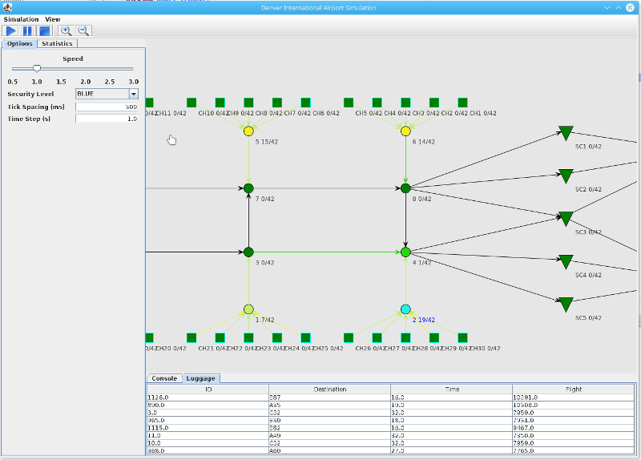

DIA Baggage Claim Simulator
================

This project aimed to simulate the Denver International Airport baggage claim
 system and thereby explore some of the problems that were encountered.  (For 
 those interested in the issues encountered at DIA, please see 
 [this](http://www.nytimes.com/2005/08/27/us/denver-airport-saw-the-future-it-didnt-work.html?mcubz=3)
 article.)
 
 At any rate, this is not a realistic simulation and was done purely as a 
 group exercise in building a somewhat large-scale program.  This project 
 models all potential luggage paths as edges on one of two directed graphs: 
 one from the ticket counter to the plane, the other from the plane to the 
 carousels.  Each piece of luggage is required to go through at least one 
 security checkpoint in order to prevent nefarious items from making it 
 on-board an aircraft.  Which items are excluded and how many abgs are 
 checked depends heavily on the airport's currently level (based off ot he 
 Homeland Security scale).  Both conveyors and the nodes to which they 
 connect may become overburndened - the status of all components in the 
 baggage claim system is color coded to denote capacity.

This is a very old and not particularly technically sound project that I like
 to keep around as a reminder of how enjoyable group projects can be.  Anyone
  who has the misfortune of completing a Computer Science or Engineering 
  program understands the pain of forced teammates, especially ones that are 
  disagreeable for whatever reason.  I am indebted to these for showing me 
  the value of group work and for making it such a pleasant experience.

Building and Running
--------------------
To build and run this project execute the following:

```shell
$ mvn exec:java -P JSE7
``````

 
 Dependencies
-------------
THis project was written for Java 1.6 and uses [Maven](https://maven.apache.org/) 
as its build system.  The following dependencies are also required:

 * [Colt](https://dst.lbl.gov/ACSSoftware/colt/)
 * [Design GridLayout](https://java-gui.blogspot.com/2011/07/designgridlayout-simple-to-use-yet.html)
 * [JUNG (Java Universal Network Graph Framework)](http://jung.sourceforge.net/)

as well as Junit with the standard Hamcrest matchers.

Screenshots
-----------
An example of this project in action:


License
-------
This project is released under the [Apache
2.0](https://www.apache.org/licenses/LICENSE-2.0) license as specified in [License.txt](License.txt).
